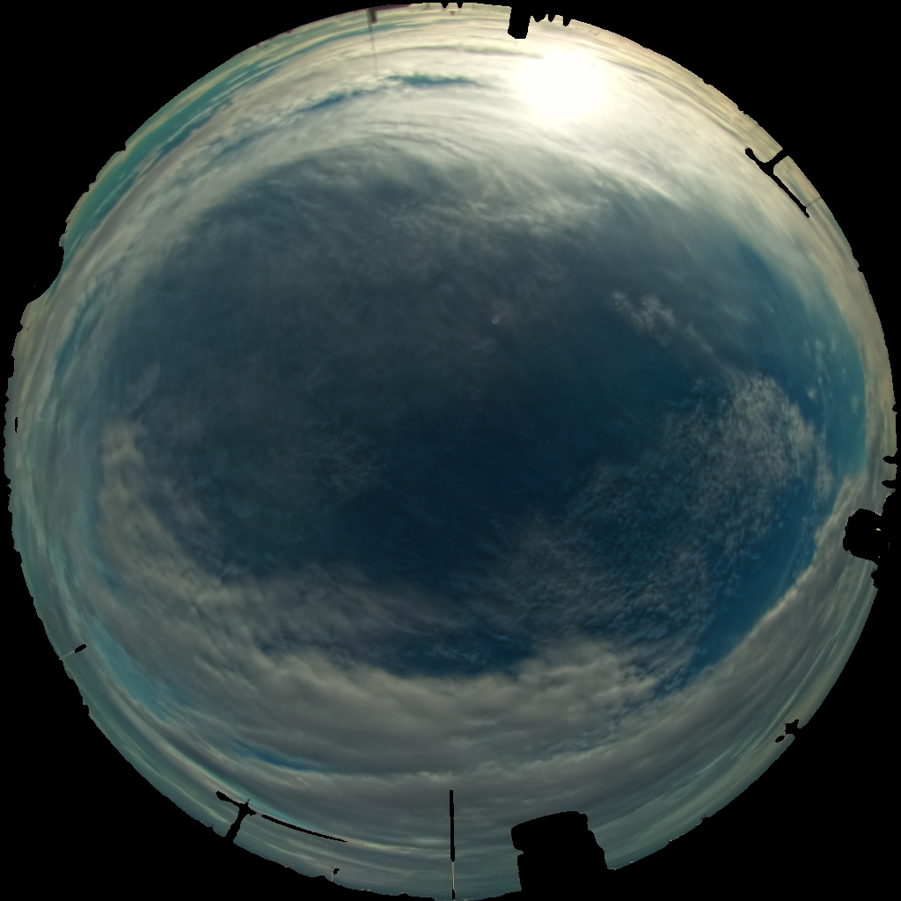
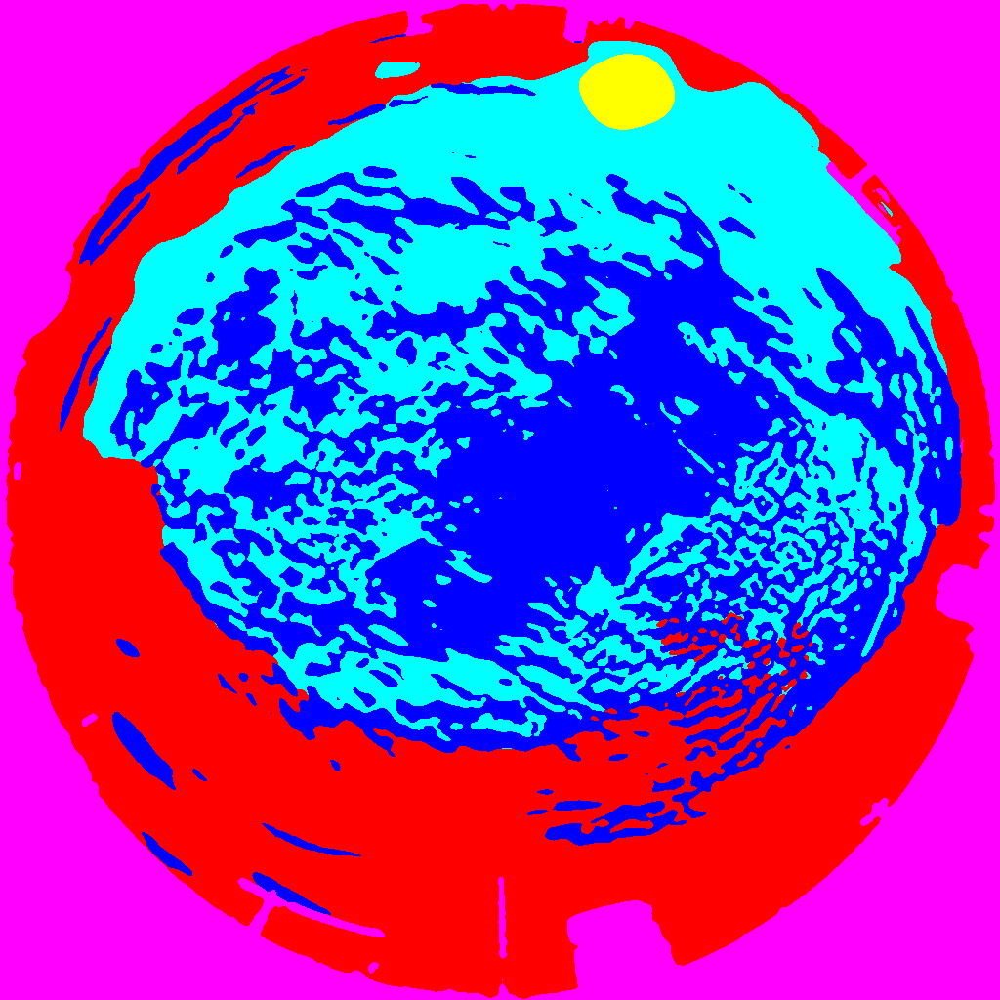
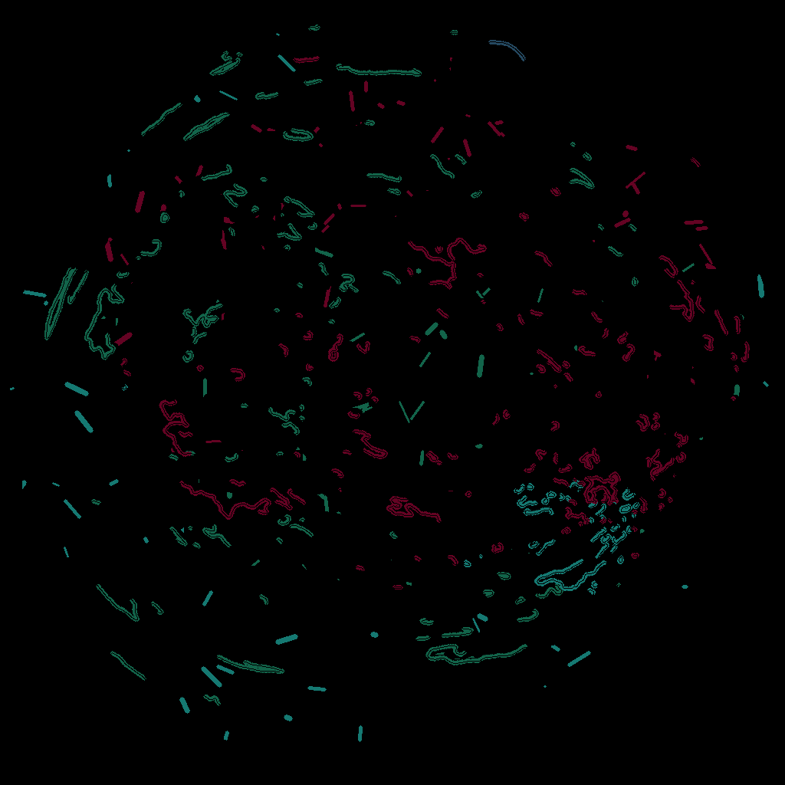

# Scribble based segmentation

so far there is a border + interlan multiclass scribble generator, It takes the original mask of N classes and returns scribbles as a new image array with the values repreenting the same classes as the riginal mask.

There is also an iterable datalodar whhich idea is to create several samples from one single image/mask pair. It will create a subset of classes and trat it as a single sample, generating scribbles for the sublcasses seected. It is important that always there is the case in which a sample represents the whole image withut scribbles so the model learns to segment with no prompts.

## Questios:
  - are the generateds scribbles good enough?
  - Is the idea of the dataloader encesary at all? or single image/mask is enough


#TODO: 
  - use the scribble gnerator and create a dataset based on some segmentation datasets (COCO, Cityscapes, anyone)
  - train a DeepLab model in which the scribbles are just other channel https://github.com/hkchengrex/Scribble-to-Mask
  - experiment with more architectures
  - fine tune in specific datasetwith few samples (clouds)
  - train just with small dataset (clouds) 


## Generation of scribble masks

In order to generate a mask of scribbles from an image mask, use the script `gen_scribble_masks.py`. This script will save your generated masks in the folder of your choice. 

```
python gen_scribble_masks.py --source 'path/directory/of/masks' --config 'path/to/parameters' --project 'path/to/save/repository'
``` 

### Example : 




